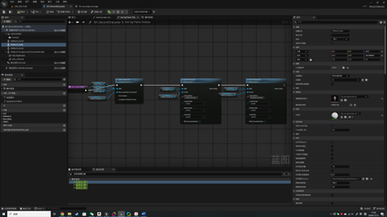
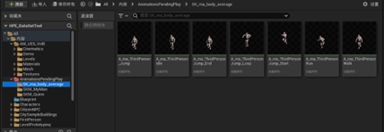
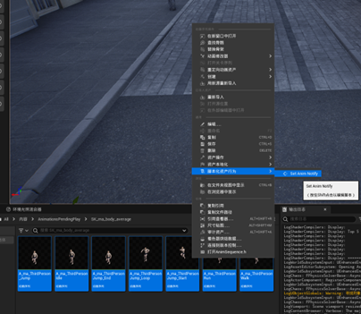
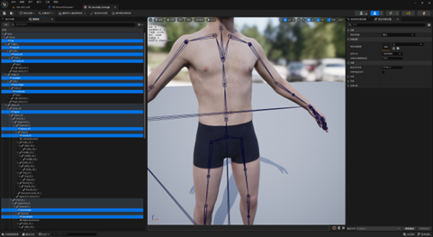
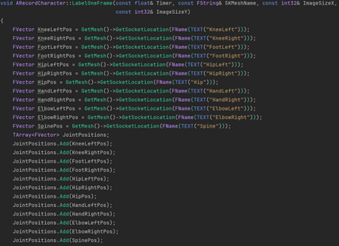

# Atsukko Dataset Tool

*Author*: Atsukko

*Institution*: Key Laboratory of Interactive Technology and Experience System，Ministry of Culture and Tourism, Beijing University of Posts and Telecommunications

## UE可配置内容
所有蓝图类位于Content/Blueprint目录下，数据的默认存储路径为Plugins/AtsukkoDatasetToolPlugin/Content/Dataset/data，如需要自行修改，可修改蓝图BP_RecordCharacter的类默认值中的DatasetDir字段，源码位于Source目录
### 1. 模型切换
(1) 在蓝图BP_RecordCharacter中切换网格体资产，如果骨骼网格体由一个引领网格体带动多个部位网格体（如图），需要在函数SetUpPartsFollow中对每个部位网格体设置引领组件，如果不是，只保留一个骨骼网格体组件即可.

(2) 在使用的网格体资产中添加对应骨骼插槽，名称敏感.

(3) 在**工程(并非插件)的Content目录下新建AnimationsPendingPlay目录**并在该目录下新建与你的模型同名的文件夹，将想要录制的动画片段拷贝到该文件夹中.

(4) 全选这些动画，右键，点击脚本化资产行为，点击Set Anim Notify，为所有动画添加结束通知.

(5) 可自定动画播放速率，同样在蓝图BP_RecordCharacter的类默认值中，修改字段PlayRate，默认0.5倍速，建议以较低速率播放，以提高单个动画使用率.

(6) 保存所有.

### 2. 记录关节点
(1) 在使用的骨骼网格体界面中添加对应骨骼插槽，以标记需要记录的关节点位置.

(2) 在C++类RecordCharacter.cpp中的LabelOneFrame函数中获取对应插槽位置并加入数组.

(3) 数据存储路径和图片尺寸可在蓝图类BP_RecordCharacter中的类默认值中修改DatasetDir和ImageSize字段进行自定义

## 使用方式

$~~~~~~~$首先将插件置入UE5.2工程的Plugins目录，打开工程，按上述说明配置好工程.

$~~~~~~~$运行模式选择新建编辑器(PIE)窗口模式，程序应该以你设置的屏幕分辨率窗口化运行，按H可以隐藏/显示HUD，按Q开始录制，开始录制后，摄像机会自动晃动以模拟不同观察角度，同时会自动以固定时间间隔(默认0.2s，可在上述蓝图的变量中的RecordInterval字段修改)采集数据，一次采集的数据包括该帧画面的图像、指定关节点与摄像机的相对坐标、该相对坐标投影到摄像机平面上的归一化平面坐标.